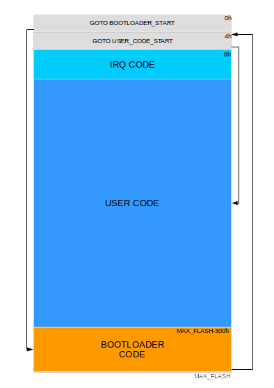
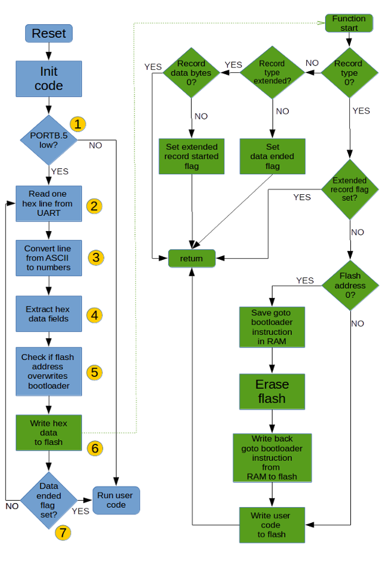
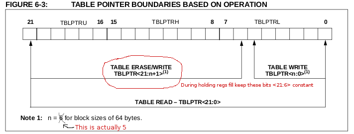

# PIC18 XLP - bootloader
This project is a bootloader for the Microchip PIC18 XLP(PIC18xxKxx) devices family, that allows users to download code into the MCU via the UART interface.

The code is written in assembly and compiled with the Microchip's MPASM assembler.
The source code from this repo is configured specifically for the PIC18F25K22 device, but with minor modifications it can be adapted to other PIC18xxKxx devices.

# Why a bootloader

- No need for a hardware programmer like PICkit to download your code in the MCU, if the bootloader is already flashed in your MCU. This is part of the Arduino's success
- Usefull for remote updates
- For me, it had educational purposes

# Bootloader code in flash memory



The bootloader code is placed in flash memory at address MAX_FLASH - 300h. This means that the size of the bootloader is 768 bytes or 384 words.

At address 0-3h in flash is placed the GOTO BOOTLOADER_START instruction. This is the first instruction executed by the MCU.

Starting with address 4h in flash, resides a GOTO USER\_CODE_START instruction. From address 8h towards the bootloader code, resides the user code.

The code that never changes is the GOTO instruction at address 0-3h and the bootloader code. Starting from address 4, the code changes according to the user application.

# Hex files

The bootloader expects .hex files in the I32HEX format. This is the default format generated from MPLAB. The format is fairly easy to understand and is well described here:
https://en.wikipedia.org/wiki/Intel_HEX

The bootloader works on the following assumptions regarding the .hex files:

- first instruction(at address 0h) is a GOTO instruction

- maximum number of data bytes in a .hex line is 16

The first assumption is correct if the code is compiled by a C compiler. The C compiler does that automatically.
If the user writes it's code in assembly, it needs to place himself a GOTO USER_CODE instruction as the instruction at address 0. This is the standard practice, but a newbie could miss that.

The second assumption is correct when the hex is generated by MPLAB.

# Bootloader code flow



In the code flow diagram I marked from 1 to 7 the essential parts of the bootloader code to describe them.

The function numbered with 6 is the most complex one and it's execution is detailed in green color.

(1) **Code execution decision**

PORTB pin RB5 is set as a digital input, used to decide if the program jumps to download mode or to user code execution.

If the pin is high at reset/power up, the bootloader will jump to address 4h leading to user code execution.

If the pin is low at reset/power up, the bootloader will go into user code download mode.

(2) **Get a .hex file line from UART**

The code reads from UART a hex file line until it gets a NEW_LINE(0xA) character. Every character read is put into a buffer.

(3) **Converting from ASCII to actual data**

This function converts 2 ASCII characters from the received hex line into the actual 8 bit values.

(4) **Extract data from line**

The data from previous step, is put in the coresponding variables: byte count, record type, flash address, data to write(put in a buffer) and checksum.

The function also calculates and validates the checksum of the line. If the checksum check fails, it reports error on UART and resets the MCU.

(5) **Check bootloader code overwrite**

This function checks if the current record to be written can overlap on the bootloader code. If this is the case, an error will be reported and MCU will reset.

(6) **Write data to flash**

This function is the most complex one and does multiple things(despite good programming practices which say that a function should do one thing only).

Each line of the hex file is called a record and has a byte that defines the record type.

The function starts by analysing the record type: data record, extended record or data ended record. It handles them as explained bellow.

*Data records handling*

If the .hex line has a **flash address >0000h**, the function writes this data record into the internal flash starting at the 16 bit address from the hex line.

If the .hex line has the **flash address = 0000h**, it means that this is the GOTO USER_CODE_START instruction.

Before writing this GOTO instruction, the function will prepare for flash erase and then will call the flash erase function.

Preparing for erase means to copy from address 0 of flash the GOTO BOOTLOADER\_START instruction into RAM. This is needed because the erase block size is 64 bytes and we can't do byte erase, to avoid the erasure of the first instruction in flash.
The flash erase function checks the address of the block to be erased in order to avoid erasing the bootloader code. Everything from address 0 to MAX_FLASH - 300h will be erased.

After erasing flash, the GOTO BOOTLOADER\_START instruction is written back to address 0. The GOTO USER\_CODE\_START instruction that is the first data record from .hex, is written to the flash address 4h and not to flash address 0h as the record asks. The reason for this is avoiding overwriting the GOTO BOOTLOADER\_START instruction, that would lead to the break of the bootloader functionality.

If the record with flash address 0000h is not a GOTO instruction as expected, MCU will report an error and reset.

More details about flashing procedure can be found bellow.

*Extended records handling*

Extended records are normally used to set 16 upper bits of the preceding data records in a 32 bits address space. The upper 16 bits are set by the extended record and the lower 16 bits are contained in each record.

The flash address in the PIC18xxKxx devices can be accessed with just 16 bits, so for normal flash operations extended records are useless. The extended records are used for setting the address to the special memory zone, used for device ID and configuration words. These memory zones go beyond 16 bit adressing: 200000h, 300000h.

The bootloader ignores the extended records and everything that follows them. As a result, the bootloader doesn't write configuration words or ID locations. These are programmed with the bootloader and can't be changed with the bootloader code.

Since the extended records are the last records in a .hex file, after an extended record is received, the bootloader ignores all the data of the following records and waits for a data ended record.
There is an exception to this rule. It was observed that when we write our code in assembly and compile it with MPASM assembler, the .hex file will start with an extended record that informs that the upper 16 bits of the 32 bit flash address are 0. This record is useless, because our devices's flash addresses are accessed with only 16 bits. Because of this, we add a check for this type of extended record and if we catch it, we don't ignore all of the subsequent records. If we would ignore them, then we wouldn't write any record at all into the flash.

*Data end record*

The data end record is placed in .hex files for our devices after the extended records, and it's the last record. When the data end record is encountered, it means that the flashing procedure is over. The bootlaoder will jump to executing user code.

# Flash memory writing

I want to detail a little bit about the flash writing procedure. The datasheet explains well the flashing procedure but it also has some mistakes.
Also, there are some flash write subtilities that bit me.

The flash write procedure happens in 2 steps:

1. The(so called) *short write*, where the data that we need to write to flash is placed into the 64 holding buffers

2. The(so called) *long write*, where the 64 byte block of data from the holding buffers is actually written into flash memory

There are 4 register and one instruction that are essential for a flash write:

- TBLPTRU register: holds the upper 8 bits of a 24 bits address space. We keep this register as 0, since 16 bits are enough for a flash size <= 64KB 

- TBLPTRH register: holds the most significant byte of the 16 bit flash memory address

- TBLPTRL register: holds the least significant byte of the 16 bit flash memory address

- TABLAT register: holds the byte to write to the flash memory address

- TBLWT\*+ instruction: writes the byte from TABLAT into a holding register, and increments TBLPTRL/TBLPTRH registers

Every record has a maximum of 16 bytes and I want to write evey line as it is received, but the flash write block is 64 bytes.
I didn't want the complications of buffering the bytes from every line until they are 64 and check if the addresses are consecutive in order to write them.
The good part is that we can write less than 64 bytes with the following trick.
After flash erase, all bits of flash memory are logic 1.
At flashing time an AND operation between the flash memory address and the holding register is performed.
The flash write procedure can only make 1 bits as 0, but not the opposite.
So we leave the holding registers of the addresses we are not interested to write, with the value FFh. This way, only the flash addresses that we are interested in writing will be modified.
Luckily, as stated in the datasheet, the holding registers are all reset to FFh after a write operation.
Some code is worth a thousand words, so let's see an example of writing 8 bytes to flash at address 2000h.

```
    ;;; this is the short write
    movlw 8
    movwf count ; put 8 in count variable
    
    movlw 1
    movwf user_data ; put 1 in user_data variable
    
    clrf TBLPTRU ; this one we keep as 0
    
    movlw 20h
    movwf TBLPTRH ; put 20h in TBLPTRH, as high byte of flash address
    
    clrf TBLPTRL ; put 0 in TBTLPTRL, as low byte of flash address

hold_regs_fill
    movf user_data, w ; put value from user_data in W reg
    movwf TABLAT ; put value from W in TABLAT reg
    TBLWT*+ ; put value from TABLAT reg in holding reg, and increment table pointer
    incf user_data ; increment user_data variable
    decf count ; decrement count variable
    bnz hold_regs_fill ; if count > 0, repeat
    TBLRD*- ; keep flash adresses in correct range 
    
    ;;; this is the long write operation, and it's always the same
    bsf EECON1, EEPGD ; point to Flash memory
    bcf EECON1, CFGS ; acces Flash program memory
    bsf EECON1, WREN ; enable write to memory
    movlw 0x55
    movwf EECON2
    movlw 0xaa
    movwf EECON2
    bsf EECON1, WR ; start program (CPU stall until done)
```

After executing this code piece, the flash address range 2000h to 20007h will be filled with the values 1 to 8.
Every execution of TBLWT\*+ instruction, makes TBLPTRL to increment with 1. If TBLPTRL overflows from FFh to 0h, TBLPTRH will also be incremented automatically by the TBLWT\*+ instruction. This is not desired, for reasons explained bellow.

One of the subtilites I was talking about, is the reason for TBLRD\*- instruction execution after the holding regs fill.
The use here of this instruction seems pointless.
This instruction decrements the table pointers(TBLPTRL/TBLPTRH registers). Why do that? Here's a quote from the datasheet:

*"Note: Before setting the WR bit, the Table Pointer address needs to be within the intended address range of the bytes in the holding registers."*

In our code example, after executing the 8'th time TBLWT\*+ instruction, the TBLPTRL pointer will increment beyond the range of flash adresses we want to write. We want to write flash adresses in range 2000h - 2007h. Now the TBLPTRL has the value 8 and the whole table pointer points to address 2008h. In this case, the table pointer is still in the 64 bytes block(2000h - 203Fh). It can happen in some cases, after executing the last TBLWT\*+ to get beyond the 64 byte block. The TBLRD\*- instruction decrements the pointer back to the block we want to write.

I learned the hard way the importance of having the table pointer in the intended adress range. I was struggling with the problem of a couple of records not written to flash or written to wrong address. I executed the code step by step with the PICKIT3 programmer/debugger. At debugging time all the adresses were OK, the TABLAT register was loaded with the correct bytes, but the records were flashed to wrong addresses or not flashed at all.

The main idea is that only the 0-5 bits of TBLPTRL register are allowed to change before starting a long write. TBLPTRH and bits 6 and 7 of TBLPTRL need to stay constant. If they change, then your record will be flashed to a wrong address or not flashed at all.

A .hex line that didn't flash OK was this one: ":10003800F8CF0FF0F5CF10F0F2A443D001D041D0A3"

The important things about the line: flash address is 0038h and it contains 16 data bytes. After more thinking and debugging, I figured that this record was breaking the table pointer in intended address range rule. After writing 8 bytes into the holding register, the TBLPTRL changes from 3Fh to 40h. This means a change in the bit 6 of the register, making the table pointer register point to the next 64 bytes block.
After discovering this problem, I added to the code a check for bits 6 or 7 change, during the holding regs loading. If a change happens to these bits, the code will flash this line in two parts, one for each block. This will keep the table pointer in the correct block at each write.

This corrected piece from the datasheet explains the table pointer address range:



# Bootloader error codes

Bootloader has checks for 3 type of errors. If any is detected, it sends on UART the following error codes and then resets:

- 'E' (0x45) \- line checksum error

- 'G' (0x47) \- first instruction of user code is not a GOTO instruction

- 'X' (0x58) \- flash adress of record overwrites bootloader zone(MAX_FLASH - 300h)

# Using the bootloader

After flashing the bootloader hex to your PIC, you can use it to flash your code in two ways:

* the python tool to flash code in your PIC

* linux command line utillities(stty, ascii-xfr)

Pin RC6 is UART TX, pin RC7 is UART RX.

The python tool is a very small and easy program, that sends every line of the .hex file to the MCU via UART at 115200 8N1 baud rate.
After sending each line it waits for the PIC to reply with 0x11 byte which means that the PIC is ready to receive a new line.
Because the tool is written in python it should work on Linux, Mac and Windows.

The usage of the python program on linux is this:
**sudo python btld.py UART_DEV file_to_write**

Usage example:
sudo python btld.py /dev/ttyUSB0 game.hex

If all was succesfull, the python program will exit with the following message:
"Finnished sending hex"

When I started writing the bootloader, I wanted to be able to interact with the bootloader using standard linux command line tools.
For this purpose the bootloader can be used with the linux ascii-xfr tool, if you activate software flow control(XON/XOFF) for your PC's UART.

When the PIC receives a line and needs to flash it, will notify the computer to stop sending data with a XOFF command(13h). After the line is flashed it will send a XON command(0x11) to notify the computer that it can receive data again

To set the UART port baud rate to 115200 and software flow control use:
**sudo stty -F /dev/ttyUSB0 115200 ixoff**

To send the hex to the bootloader use:
**sudo ascii-xfr -sv -l 100 hex_file > /dev/ttyUSB0**

The parameter "-l 100" in ascii-xfr command adds a 100ms delay after sending each line to the PIC. This delay is mandatory for PIC to have time to reply with the XOFF character when the end of line character is received. If this delay is missing, then a UART overrun will happen in the PIC and all communication will be broken.

# Porting bootloader code

The bootloader runs on a PIC18F25K22 with a clock(Fosc) of 64MHz. This clock comes from PIC's internal high frequency oscillator of 16MHz and it's multiplied by 4 with PIC's internal PLL frequency multiplier.
So, in order to use the internal oscillator the following config word is needed: **CONFIG  FOSC = INTIO67**.
The high frequency internal oscillator and x4 PLL multiplier are enabled from software by writting to the OSCCON and OSCTUNE registers:
```
    movlw 0x70
    iorwf OSCCON ; select 16 MHz internal oscillator
    bsf OSCTUNE, PLLEN
```

If a user wants to port the code for a board that uses an external oscilator, it will have to modify accordingly the config words, and delete the OSCCON and OSCTUNE register code.

If the code needs to be ported to a PIC with a different flash memory size, the following line needs to be modified accordingly: **max_flash equ 0x8000**

Other modifications could be the UART baud rate, or the UART RX/TX pins used, which can be changed in **uart_init** function.

A user can also modify the GPIO needed for the code download/user code mode. This can be done in the **StartBtld** function.

# References

A big source of inspiration for me was this bootloader implementation, that I used a lot in the past. It works on multiple PIC types: http://www.etc.ugal.ro/cchiculita/software/picbootloader.htm

Hex file format explanations: https://en.wikipedia.org/wiki/Intel_HEX

Uart software flow control: https://en.wikipedia.org/wiki/Software_flow_control


